TUTORIAL DISCORD
===============

O **Discord** é um aplicativo de chat em texto e voz, podendo ser usado tanto entre duas pessoas como para um grupo com milhares de pessoas. A proposta dele é de substituir o Skype e o TeamSpeak, sendo que ele possui várias funcionalidades a mais. Ele é muito interessante para a Bits especialmente pela possibilidade de organizar as conversas em vários canais de texto, cada um com sua finalidade. Aqui, vamos mostrar o que você precisa para entrar no grupo da ITA Bits no Discord e interagir com os demais membros. As demais coisas você irá aprender com o uso. 

__O Discord será nossa principal forma de comunicação.__

O Discord pode rodar no seu computador, celular, tablet, e até mesmo no seu navegador (mas com alguns bugs xD). Aconselhamos que você instale o aplicativo tanto no seu computador pessoal quanto no seu celular. Este tutorial irá exemplificar o Discord no computador, desde a instalação até configurações e como usar. Posteriormente, pro seu celular, basta buscar o aplicativo na Play/App Store, instalar e efetuar login, pois a configuração será praticamente mantida e o uso é análogo.

1 – DOWNLOAD E INSTALAÇÃO
-------------------------

Acesse https://discordapp.com/. Na parte superior esquerda do site, clique em Baixar.

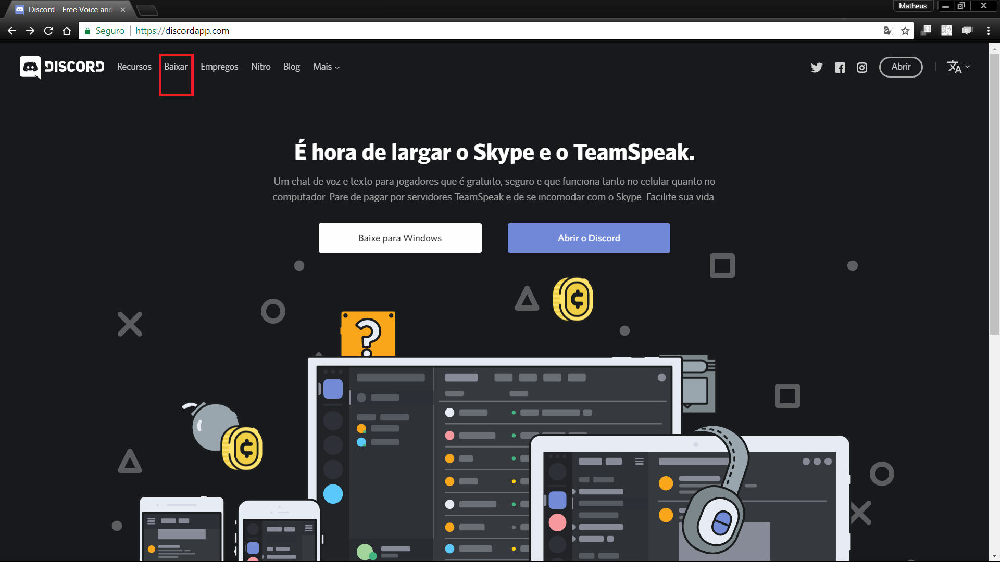

Faça download do instalador correspondente à sua plataforma.

 
Clique no instalador para que a instalação seja iniciada. Caso apareça uma janela perguntando se você deseja executá-lo, basta clicar em Executar.

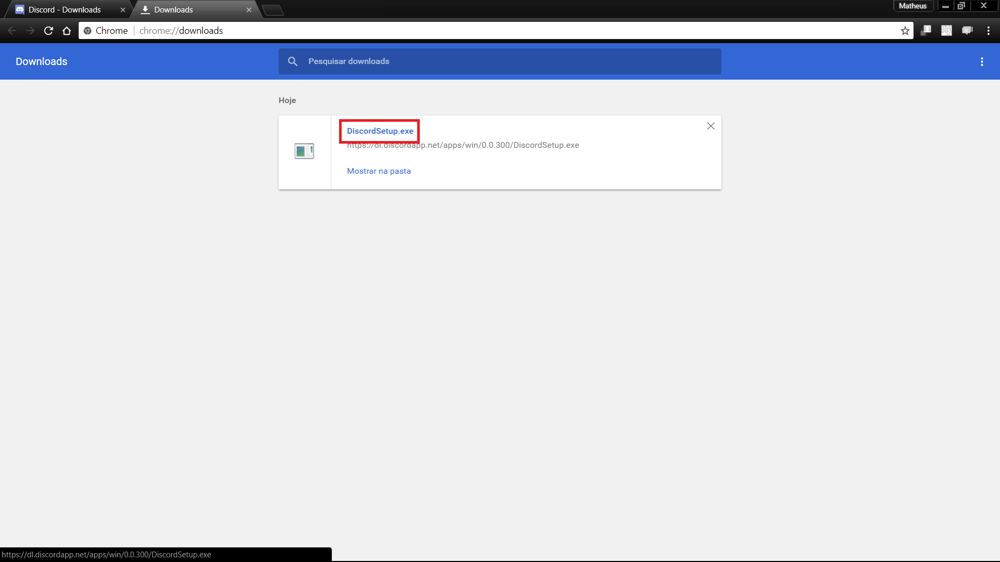
 
Após isto, a instalação provavelmente ocorrerá sem interrupções. 

2 – FAZENDO CADASTRO E LOGIN
----------------------------

Quando a instalação terminar, o aplicativo provavelmente iniciará sozinho. Caso isso não aconteça, encontre o ícone do Discord na sua Área de Trabalho e clique duas vezes.
 
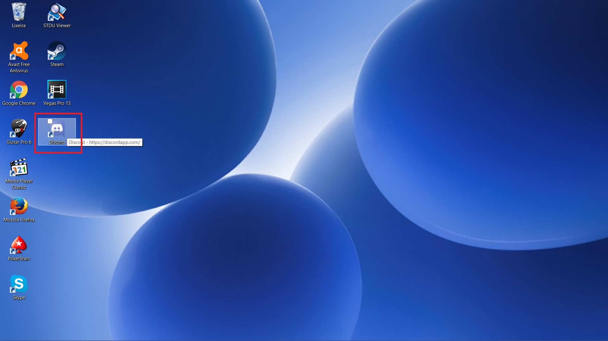

A tela de carregamento do Discord irá aparecer.
 

Na tela de Login do Discord, clique em Cadastre-se.
 
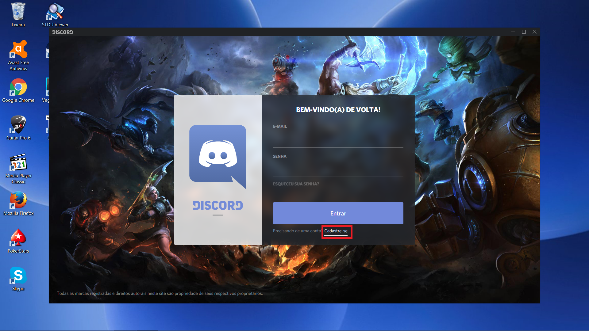

Preencha seus dados e clique em Continuar.
 
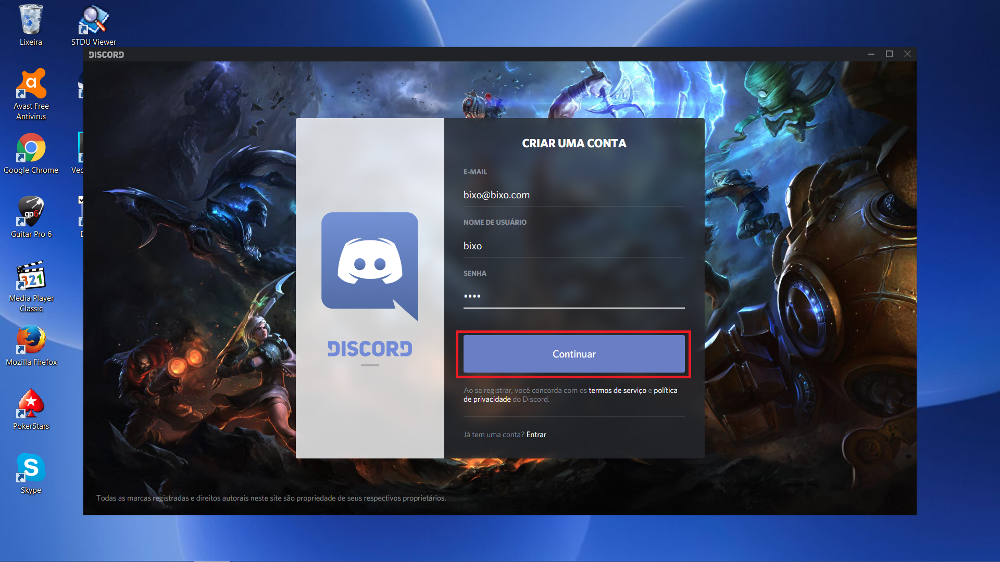

Após isto, provavelmente o Discord fará login automático para você. Se não fizer, entre com o email e senha que você colocou no cadastro. Você será redirecionado para a tela abaixo, onde terá que fazer a verificação tanto por email quanto por telefone.
 
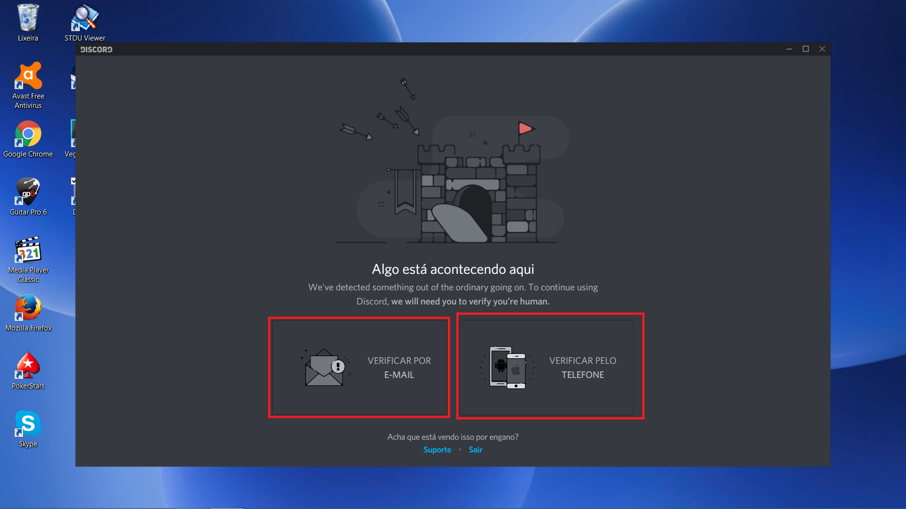

Pra verificar pelo email, clique em Verificar Por E-Mail. Depois, vá na Caixa de Entrada do email que você colocou em cadastro, olhe o email que você recebeu do Discord, e clique no link que está lá. Se tudo der certo, o retângulo de Verificar Por Email vai sair do seu Discord (talvez precise relogar, n me lembro). Provavelmente você ainda vai ter que verificar também pelo telefone. Para isso, clique em Verificar Pelo Telefone. A tela abaixo irá aparecer pra você. Coloque o número de telefone seu ou de um coleguinha (importante que telefone possa receber SMS).

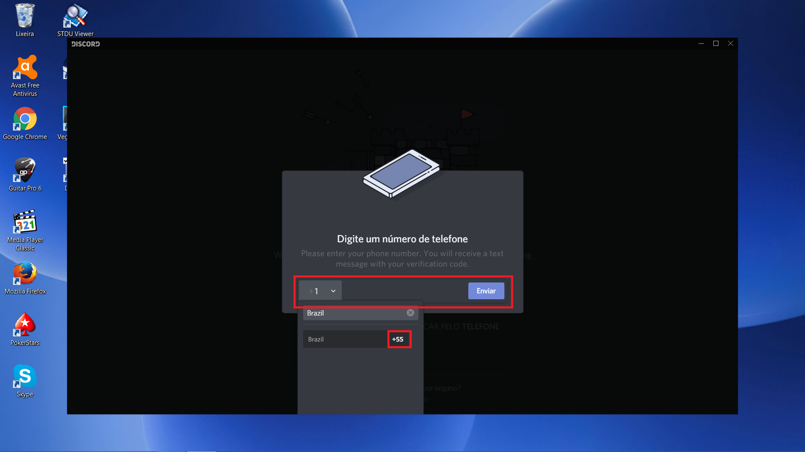

Você vai receber no celular um SMS com seis dígitos. Coloque eles na tela que vai aparecer no discord.

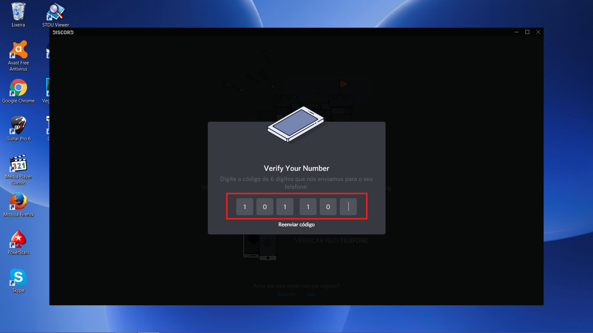
 
Feito isso, você estará logado e pronto pra usar o Discord.

3 – CONFIGURAÇÃO
----------------

Após ter feito as verificações, a seguinte tela do Discord irá aparecer pra você.

Legendas:
- :ledger: Amarelo - Aqui o Discord irá mostrar seus contatos (em verde) e as mensagens privadas (em roxo) que você trocou. Você pode conectar suas contas de redes sociais e jogos para achar os seus amigos que possuem Discord. Além de poder adicionar as pessoas que você encontrar em grupos do Discord. 
- :green_book: Verde - Aqui você pode filtrar seus amigos entre "Todos", "Online" e "Pendente". Em "Bloqueado" você pode ver as pessoas que você não quer que te adicionem nem mandem mensagens/ligações.
- :closed_book: Vermelho - Aqui ficarão os grupos que você participa.
- :orange_book: Laranja - Aqui fica o botão das suas configurações pessoais, além dos botões para alterar seu status, e mutar/ativar seu microfone ou fone de ouvido, caso esteja usando chats de voz.

Nas configurações pessoais, você pode alterar dados da sua conta e configurações do aplicativo.
Inicialmente, recomendo que configure as suas notificações. Nessa parte muda do celular pro computador, então vou deixar aqui prints da minha configuração em cada dispositivo. No PC:

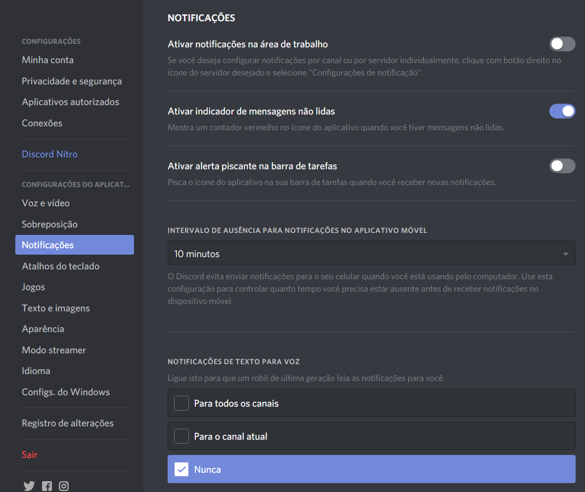

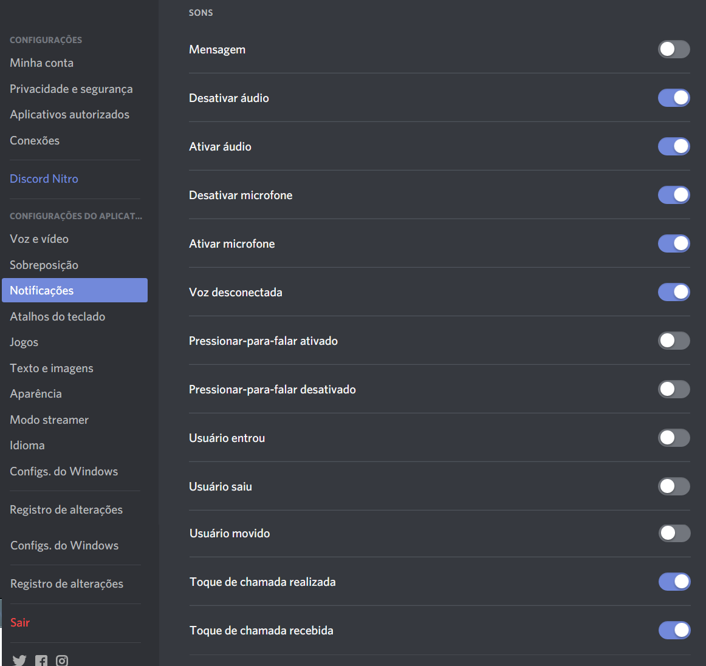
 
Configs. No Celular:

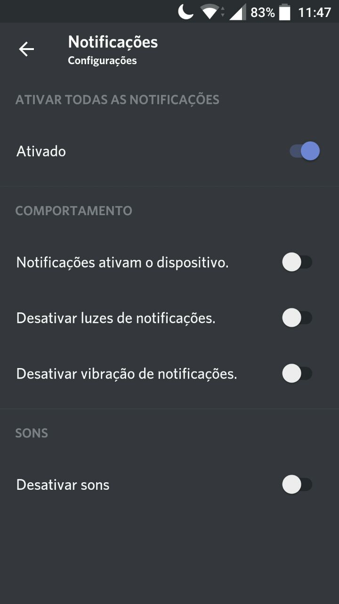
 
Quando você se acostumar com o aplicativo, fique à vontade pra alterar essas configurações caso queira ou precise. As configurações de voz e vídeo, por exemplo, podem ser relevantes em outros contextos que não o da ITA Bits. 

Vale mencionar também que o Discord vem pré-configurado pra iniciar junto com o Windows e minimizar pra "setinha" junto do WiFi, Volume, etc., quando você clica pra fechar o app. Caso você não goste dessas coisas (eu gosto **¯\\_(ツ)_/¯** ), isso pode ser alterado em Configurações -> Configs. do Windows.

4 – ENTRANDO NO GRUPO DA BITS
-----------------------------

Para entrar no grupo da Bits, clique no link que você recebeu por email. Uma nova aba vai ser aberta no seu navegador, e após ela ser carregada, vá até o seu Discord. Lá irá aparecer o seguinte:

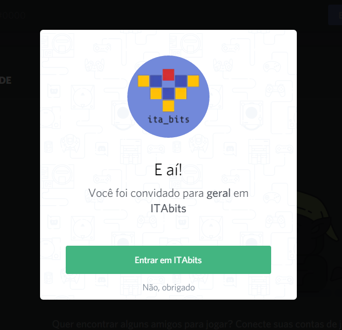

Pode fechar a aba que foi aberta no navegador. No Discord, o que você irá ver agora é isto:

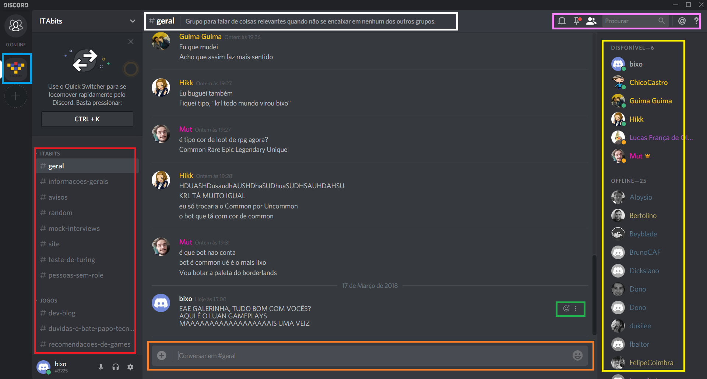

Legendas:

- :blue_book: Azul – Apareceu o grupo da ITA Bits na coluna de grupos. Sempre que quiser acessar o nosso canal, basta clicar ali. Clicando com o botão direito, surgem algumas opções, entre elas, configurações específicas do servidor para você, que você pode ajustar. As minhas são as seguintes:
- :closed_book: Vermelho – Aqui aparecem todos os canais de texto e voz que a ITA Bits usa. Canais de texto têm uma hashtag (#), canais de voz têm um alto falante. Atualmente não usamos canal de voz, mas tem um ali pra caso queiramos conversar. Antes de sair mandando mensagens em todos os canais, descubra a finalidade de cada um deles, conforme está descrito no canal **#informacoes-gerais**.
- :ledger: Amarelo – Aqui vocês podem ver os demais membros do grupo da Bits. A lista separa as pessoas entre quem está online e off-line, além de exibir cores diferentes para as pessoas de acordo com o cargo de cada uma. Clique com o botão esquerdo para ver mais informações da pessoa e/ou para iniciar uma conversa privada com ela. O botão direito também te dará mais opções.
- :white_circle: Branco –  Aqui mostra qual o canal que está aparecendo pra você no momento, além de uma descrição do mesmo.
- :orange_book: Laranja – Aqui você envia mensagens para o canal. Usando o +, você consegue enviar qualquer tipo de arquivo (docs, fotos, gifs, memes). E clicando na carinha, surgirão infinitas opções de emoticons. 
  
  Vou aproveitar pra falar sobre menções. Mencionar no Discord tem uma ideia similar à marcar no Facebook. Você pode mencionar pessoas/cargos nas suas mensagens usando **@nomeDelas**/**@nomeDoCargo**. Existem também menções especiais, que são: **@here** para mencionar todos que estão online e **@everyone** pra mencionar todo mundo (todo mundo mesmo). Você pode também mencionar os canais usando **#nomeDoCanal**. 
- :green_book: Verde – Nos pontinhos você pode editar ou excluir suas mensagens. Na carinha, você pode reagir às mensagens tanto suas quanto dos demais.
- :cherry_blossom: Rosa – No sininho você pode silenciar o canal (desativar notificações exceto quando for mencionado). No pininho você pode ver as mensagens fixadas daquele canal. Nas pessoinhas você consegue exibir/ocultar a coluna de pessoas do grupo. A barra de pesquisas você pode usar para encontrar informações em qualquer lugar do grupo. O arroba (@) mostra todos os lugares onde você foi mencionado, podendo filtrar só pra este servidor, e excluir as menções @everyone e as menções do seu cargo (que provavelmente será **@bixo**). A interrogação é a ajuda do Discord, que eu nunca usei e espero que você também não precise nunca usar.

É isto bixaral. Enjoy.

Written By: ~~Christopher Nolan~~ Matheus Bertolino.
